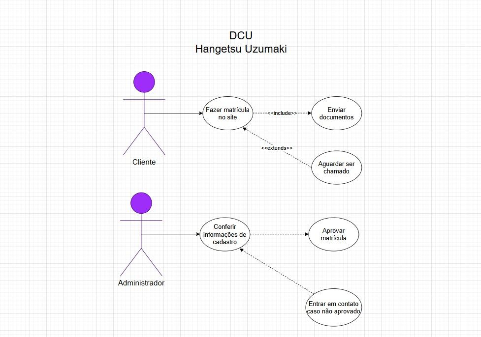
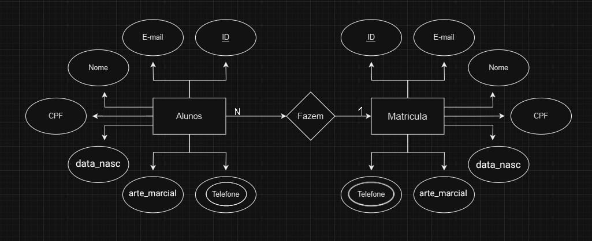
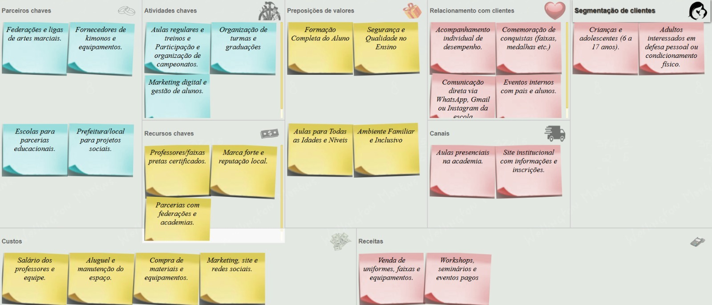

# Artes Marciais

- Metodologia: Kanban
- Tema inicial: Hangetsu Uzumaki - Artes Marciais

|Recursos|Papéis e Responsabilidades|
|-|-|
|Hélio|Back/Teste/Banco de dados|
|João Santos|Front/Banco de Dados|
|Rhayssa|Front/Banco de Dados|

## BackLog
- [x] Criar/atualizar o cronograma
- [x] Modelar o negócio no Quadro Canvas
- [x] Criar o repositório do projeto no GitHub e adicionar os membros como colaboradores (Tudo que for desenvolvido deve estar neste repositório, podendo ter mais de um repositório, mas o principal deve ser este e possuir link para os outros)
- [x] Desenvolver o MER x DER Inicial
- [x] Desenvolver o diagrama de classes inicial
- [x] Listar os requisitos funcionais na ordem [RF001], [RF002], [RF003], ... e os requisitos não funcionais na ordem [NF001], [NF002], [NF003], ... (não é necessário detalhar os requisitos, apenas listar)
- [x] Para cada requisito funcional deve ser desenhado um DCU (Diagrama de Casos de Uso).
- [x] Iniciar o desenvolvimento do projeto, criando as pastas e arquivos iniciais (README.md, .gitignore, etc).
- [x] Desenvolver um protótipo funcional do App com Figma

## Sprint 3º
- [x] UML DC (Diagrama de Classes) Back-End
 - [x] Iniciar a codificação/desenvolvimento Banco de dados
 - [x] Iniciar a codificação/desenvolvimento Back-end
 - [x] Iniciar a codificação/desenvolvimento Front-end
- [x] Iniciar a codificação/desenvolvimento Mobile
 - [x] UML DA (Diagrama de Atividades) Front-End
 - [x] Análise de Viabilidade com Matriz SWOT
 - [x] Triângulo da qualidade do Projeto (Escopo, Prazo e Custo)
 - [x] Protótipo (Wireframe) do Front-end e Mobile

## Diagramas do Projeto

## 📘 Diagrama de Classes (Back‑End)


## 📗 DCU do Projeto


## 📙 Diagrama do Projeto

 
## 📙 canva
 

## 📙 triangulo de ferro


## 📙 swot


## 📙 grefico gant


## Checklist de Testes – Projeto
## Testes Gerais

Verificar se o endpoint / retorna 200 e informações da API.

## Testes de Alunos

Criar aluno (POST /alunos) → verificar campos obrigatórios e email único.

Listar todos alunos (GET /alunos) → deve retornar lista completa.

Obter aluno por ID (GET /alunos/:id) → 200 se existir, 404 se não existir.

Atualizar aluno (PUT/PATCH /alunos/:id) → alterar campos opcionais, mantendo email único.

Remover aluno (DELETE /alunos/:id) → 200 ou 204.

Login do aluno (POST /alunos/login) → com credenciais válidas retorna token; inválidas retorna 400.

Validar token do aluno (GET /alunos/login) → 200 com token válido; 401 com token.

## Testes de Professores

Criar professor (POST /professores) → verificar campos obrigatórios e email único.

Listar todos professores (GET /professores) → deve retornar lista completa.

Obter professor por ID (GET /professores/:id) → 200 se existir, 404 se não existir.

Atualizar professor (PUT/PATCH /professores/:id) → alterar campos opcionais, mantendo email único.

Remover professor (DELETE /professores/:id) → 200 ou 204.

## Testes de Telefones

Criar telefone (POST /telefones) → verificar campos obrigatórios.

Listar todos telefones (GET /telefones) → deve retornar lista completa.

Obter telefone por ID (GET /telefones/:id) → 200 se existir, 404 se não existir.

Atualizar telefone (PUT/PATCH /telefones/:id) → alterar campos opcionais.

Remover telefone (DELETE /telefones/:id) → 200 ou 204.

## Testes de Turmas

Criar turma (POST /turmas) → verificar campos obrigatórios.

Listar todas turmas (GET /turmas) → deve retornar lista completa.

Obter turma por ID (GET /turmas/:id) → 200 se existir, 404 se não existir.

Atualizar turma (PUT/PATCH /turmas/:id) → alterar campos opcionais.

Remover turma (DELETE /turmas/:id) → 200 ou 204.

## Testes de Matrículas

Criar matrícula (POST /matriculas) → verificar campos obrigatórios, relacionamentos válidos com aluno e turma.

Listar todas matrículas (GET /matriculas) → deve retornar lista completa.

Obter matrícula por ID (GET /matriculas/:id) → 200 se existir, 404 se não existir.

Atualizar matrícula (PUT/PATCH /matriculas/:id) → alterar campos opcionais.

Remover matrícula (DELETE /matriculas/:id) → 200 ou 204.


## Passo a passo para testar
- 1 Clone este repositório
- 2 Abra o repositório com o VsCode, Abra um terminal **CTRL + '** cmd ou bash
- 3 Abra o XAMPP e inicie o SGBD **MySQL**, ou inicie o MySQL da forma que preferir.
- 4 Crie dentro da pasta ./api um arquivo chamado **.env** contendo as seguintes variáveis de ambiente:
```js
DATABASE_URL="mysql://root@localhost:3306/escola?schema=public&timezone=UTC"

